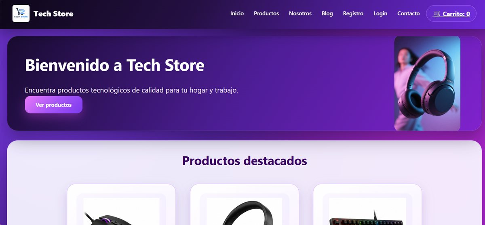
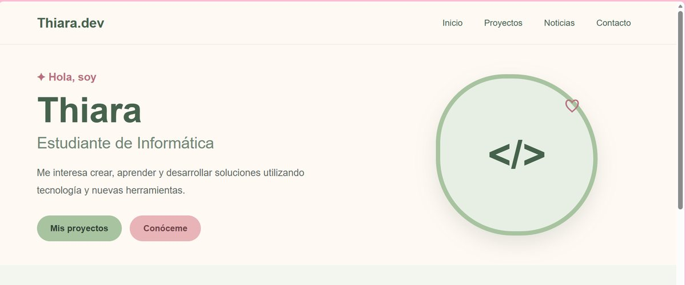
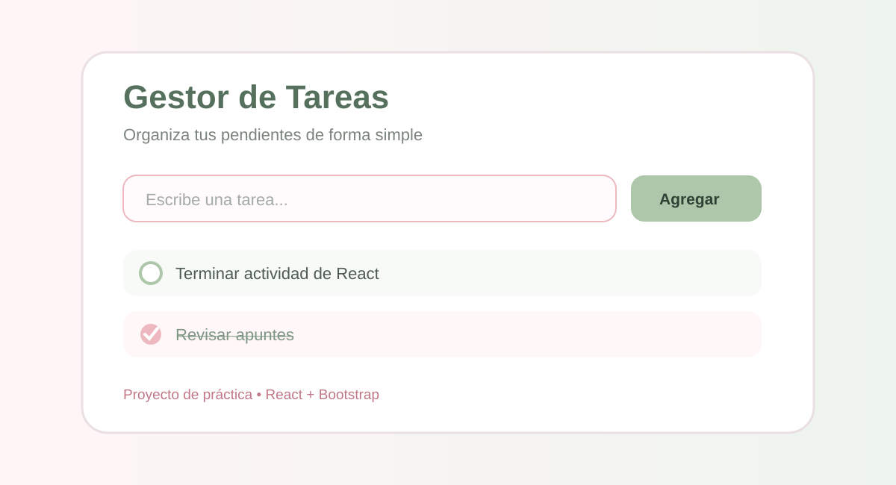

# Portafolio Personal - Thiara

Portafolio personal desarrollado con React y Bootstrap para la asignatura Desarrollo Fullstack II.

## Contenido

- Inicio con presentación personal.
- Componente reutilizable de Sobre mí.
- Sección de proyectos con Cards de Bootstrap.
- Proyecto colaborativo TechStore con enlace a su repositorio.
- Portafolio personal como proyecto React.
- Demo interna de un Gestor de Tareas.
- Noticias cargadas desde un archivo JSON.
- Uso de props y state.
- Formulario de contacto con validaciones.
- Diseño responsivo usando Bootstrap Grid.
- Pruebas unitarias con Jasmine y Karma.
- Informe de cobertura con karma-coverage.

## Tecnologías principales

- React
- React Bootstrap
- React Router
- JavaScript
- JSON
- Jasmine
- Karma

## Instalación

```bash
npm install
```

## Ejecutar el proyecto

```bash
npm start
```

## Ejecutar las pruebas

```bash
npm test
```

Al terminar las pruebas se genera la carpeta `coverage` con el informe de cobertura.

## Plan de pruebas

| Componente | Caso que se prueba | Resultado esperado |
| --- | --- | --- |
| BarraNavegacion | Renderizado de enlaces | Se muestran Inicio, Proyectos, Noticias y Contacto |
| Inicio | Presentación y componente SobreMi | Se muestra el nombre, descripción e ilustración |
| TarjetaProyecto | Datos recibidos por props | La tarjeta muestra título, descripción e imagen |
| Proyectos | Renderizado de proyectos | Se muestran los tres proyectos |
| TarjetaNoticia | Datos recibidos por props | Se muestran título, fecha y contenido |
| Noticias | Lectura del JSON y renderizado | Se muestran las secciones Aprendizaje y Portafolio |
| Contacto | Envío vacío | Se muestran los mensajes de validación |
| Contacto | Datos válidos | Se muestra el mensaje de confirmación |
| Contacto | Simulación de envío | Un spy de Jasmine confirma que se ejecuta el envío |
| DemoTareas | Agregar tarea | La nueva tarea aparece en el listado |
| DemoTareas | Tarea vacía | No se agrega una tarea sin texto |
| DemoTareas | Cambiar estado | La tarea cambia a completada |
| DemoTareas | Eliminar tarea | La tarea desaparece del listado |

## Ejemplos de uso

- En **Proyectos** se puede abrir el repositorio de TechStore y la demo del Gestor de Tareas.
- En **Noticias** los datos se obtienen desde `src/datos/noticias.json` y se muestran usando componentes reutilizables.
- En **Contacto** el formulario valida nombre, correo y mensaje antes de registrar el envío.
- En **Gestor de Tareas** se pueden agregar, completar y eliminar tareas.

## Crear versión de producción

```bash
npm run build
```

## Capturas de proyectos

### TechStore



### Portafolio Personal



### Gestor de Tareas



## Autora

Thiara Rojas  
Estudiante de Informática
